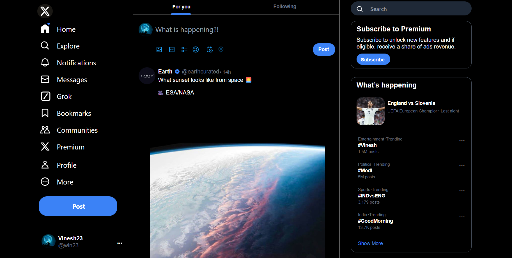

# Twitter Clone

## Description
Welcome to the **Twitter Clone** project! This is a simple Twitter-like web application built using **Tailwind CSS** for styling and **JavaScript** for interactivity. This project is a demonstration of building a responsive and interactive user interface with modern web technologies.

## Features

- **Interactive Elements**: Includes dynamic elements like follow/unfollow buttons, search functionality, and responsive design tailored for laptops and tablets.
- **Tailwind CSS**: Utilizes Tailwind CSS for responsive and utility-first styling.
- **JavaScript**: Implements interactive features such as toggling follow buttons, showing/hiding elements on input focus, and more.

## Screenshots

## Technologies Used

- Vite React
- Tailwind CSS
- JavaScript

## Usage

 - Search Input: Click on the search input to display a box with additional options. The box will hide when the input loses focus.
 - Follow/Following Buttons: Toggle between "Follow" and "Following" states on user profiles.
 - Dynamic Content: Interact with various elements to see content changes and visibility toggles.
 

## What I Learned

- Implemented responsive design principles with Tailwind CSS, optimized for laptop and tablet views.
- Handled interactive elements and DOM manipulation with JavaScript.
- Gained experience in structuring and managing a web application project.

## Authors

- [VineshRajkumar](https://github.com/VineshRajkumar)
